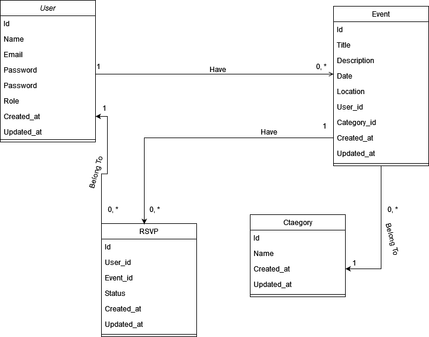

# Event-Management-System

A web application built with Laravel that allows users to create and manage events, RSVP to events, and view event details. It includes user authentication, event creation and management, RSVP functionality, and user roles.

## Modeling

